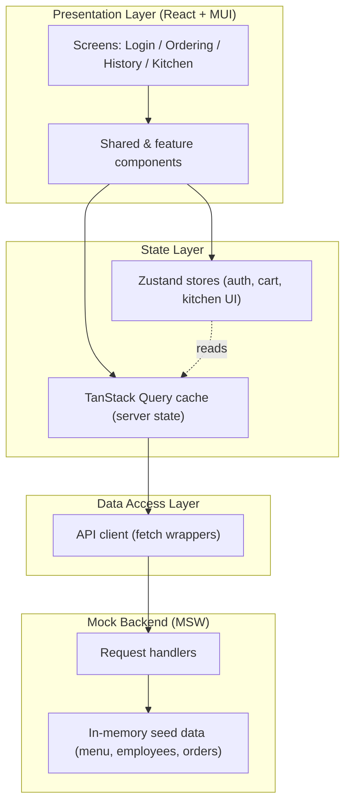
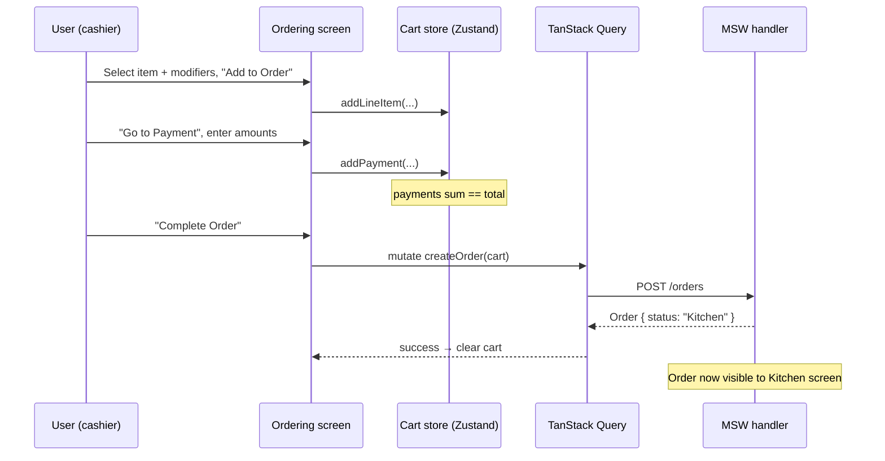

# Architecture Overview

> Companion to [features.md](features.md). Defines the high-level technical
> architecture for the Point of Sale (POS) demo.

## 1. Purpose & Scope

A single-page, client-only React application that simulates a fast-food POS
terminal. It has no real backend: every "API call" is intercepted by a mock
layer and served from in-memory seed data. The app is optimized for large
tablet displays (1280×1024 → 1920×1080) in landscape.

**Non-goals:** real authentication/security, real payment processing,
persistence across reloads, multi-user sync, offline support.

## 2. Technology Stack

| Concern | Choice | Notes |
| --- | --- | --- |
| Language | TypeScript (`~6.0`) | Strict mode expected across app code. |
| Build tool | Vite (`^8`) | Dev server + production bundle. |
| UI library | React 19 | Function components + hooks only. |
| Component kit | **MUI (Material UI) v9** — exclusive UI library | `@mui/material`: buttons, grids, dialogs, layout. No other component kit is used. |
| Data grid | `@mui/x-data-grid` v9 | Order History results grid. |
| Icons | `@mui/icons-material` v9 | Menu/category button icons. |
| Styling | Emotion (`@emotion/react`, `styled`) | MUI's built-in engine, via `sx` + `styled` + theme. No ad-hoc CSS. |
| Routing | `react-router` v8 | Screen-level navigation + auth guard. |
| Server state | TanStack Query v5 | Wraps all mock API calls. |
| Client state | Zustand | Auth session + active order (cart) + UI. |
| API mocking | MSW (Mock Service Worker) | Intercepts `fetch` in browser. |
| Deployment | Docker + nginx | Static bundle served by nginx. |

## 3. Architectural Style

A layered, feature-oriented SPA:

### Layer responsibilities

- **Presentation** – Renders screens/components, dispatches user intent. No
  business rules beyond formatting; delegates to state + data layers.
- **State** – Two distinct kinds of state:
  - *Server state* (menu, order lists, order details) lives in **TanStack
    Query**. Never duplicate it into Zustand.
  - *Client state* (who is logged in, the in-progress order being built, active
    payment entry, kitchen board layout) lives in **Zustand**.
- **Data access** – Thin typed `fetch` wrappers returning domain models. This is
  the single seam between the app and the "network".
- **Mock backend** – MSW handlers implement the [API contract](04-api-contract.md)
  against an in-memory data module seeded at startup.

## 4. Key Architectural Decisions

| # | Decision | Rationale | Alternatives rejected |
| --- | --- | --- | --- |
| AD-1 | MSW for mocks (not stubbed service functions) | Realistic network seam; components/queries are written as if a real backend exists, easing a future swap. | Plain in-memory service modules. |
| AD-2 | Zustand for client state | Minimal boilerplate for cart/auth; avoids prop drilling; testable outside React. | React Context (verbose for cart), Redux Toolkit (heavy). |
| AD-3 | In-memory only, no persistence | Demo simplicity; each reload restores a clean, deterministic seed. | localStorage/IndexedDB. |
| AD-4 | TanStack Query owns all server data | Caching, background refetch, and the Kitchen board's polling come "for free". | Manual `useEffect` fetching. |
| AD-5 | Feature-first folder structure | Screens are largely independent; keeps cohesion high. | Layer-first (`components/`, `hooks/`, ...). |
| AD-6 | **MUI (Material UI) v9 as the sole UI library** | One consistent, accessible, touch-friendly component set + theming; `@mui/x-data-grid` covers the History grid. All styling via `sx`/`styled`/theme — no other UI kit or ad-hoc CSS framework. | Chakra UI, Ant Design, hand-rolled components + plain CSS. |

## 5. Cross-Cutting Concerns

- **Auth guard** – A route wrapper redirects unauthenticated users to `/login`.
  Because state is in-memory, a reload logs the user out (acceptable for demo).
- **Money handling** – All monetary values are stored and computed as **integer
  cents** to avoid floating-point drift; formatted to `$0.00` only at the edge.
  See [data models](02-data-models.md#money).
- **Error/loading UX** – Query `isLoading`/`isError` drive MUI skeletons and
  inline error banners. Login errors are surfaced inline per features.md.
- **Determinism** – Seed data (menu, 1 employee, 15 orders) is generated from a
  fixed dataset so the demo looks identical on every run.
- **Kitchen polling** – The Kitchen screen uses a TanStack Query with a refetch
  interval (and/or store subscription) plus a 10s in-card scroll timer.

## 6. Runtime Flow (order lifecycle)

## 7. Deployment

- `npm run build` → `tsc -b` + `vite build` produces a static `dist/`.
- `Dockerfile` builds the bundle and serves it via **nginx** (`nginx.conf`).
- MSW runs **in the browser** (service worker), so mocking works in the deployed
  static site with no server component.

## 8. Related Documents

1. [Architecture Overview](01-architecture.md) *(this file)*
2. [Data Models & Schema](02-data-models.md)
3. [Screen & UI Component Design](03-ui-components.md)
4. [API / Mock Service Contract](04-api-contract.md)
5. [State Management & Routing](05-state-and-routing.md)
6. [Folder Structure & Conventions](06-project-structure.md)
