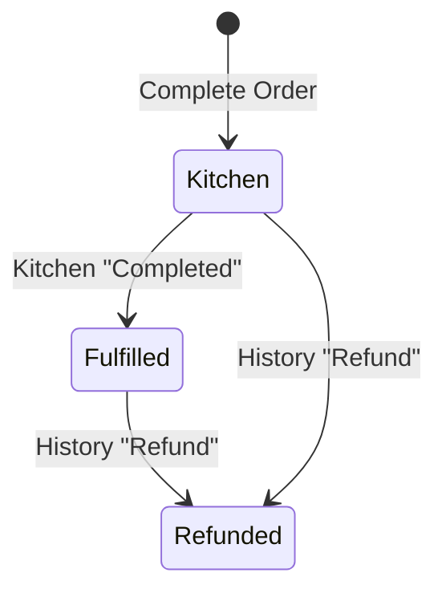

# Data Models & Schema

> Companion to [features.md](features.md) and the
> [architecture overview](01-architecture.md). Defines the TypeScript domain
> types used across the app, mock API, and seed data.

## Conventions

- All types live under `src/types/` and are imported by app + mock layers.
- Identifiers are `string`.
- Timestamps are ISO-8601 strings (`string`) at the boundary; parsed to `Date`
  only for display/sorting.
- <a id="money"></a>**Money is stored as integer cents (`number`)**, never a
  float. `520` means `$5.20`. A `formatMoney(cents)` helper renders `$0.00`.

## 1. Menu

Mirrors the nested structure in features.md (Category → Category Item → Item).

```ts
// Pane 1
export interface MenuCategory {
  id: string;
  name: string;        // Button text, e.g. "Combos"
  icon: string;        // MUI icon id, e.g. "Fastfood"
  items: CategoryItem[];
}

// Pane 2
export interface CategoryItem {
  id: string;
  name: string;        // Button text, e.g. "Combo #2"
  icon: string;        // MUI icon id
  items: MenuItem[];   // Configurable items shown in Pane 3
}

// Pane 3 — a configurable product
export interface MenuItem {
  id: string;
  displayName: string;         // Full name
  basePriceCents: number;      // Price before modifications
  sizes: MenuChoice[];         // Empty => single size
  modifiers: MenuModifier[];   // Ingredient add/remove, e.g. "No Cheese"
  options: MenuOption[];       // Sub-selections, e.g. side / drink type
}

export interface MenuChoice {
  id: string;
  name: string;                // e.g. "Large"
  priceModifierCents: number;  // +/- from base; 0 for default selection
  isDefault?: boolean;
}

export interface MenuModifier {
  id: string;
  name: string;                // e.g. "Add Pickles", "No Cheese"
  priceModifierCents: number;  // e.g. +10 or -50
  defaultSelected?: boolean;   // Standard ingredient included by default
}

export interface MenuOption {
  id: string;
  name: string;                // e.g. "Fries", "Onion Rings"
  priceModifierCents: number;
  isDefault?: boolean;
}

export interface Menu {
  categories: MenuCategory[];
}
```

> **Uniqueness note (from features.md):** the same product may appear under
> multiple categories (e.g. a cheeseburger under *Burgers* and *A La Carte*).
> `MenuItem.id` is unique per node; the same conceptual product can be
> duplicated across the tree with distinct ids.

## 2. Employee

```ts
export interface Employee {
  id: string;    // 6 chars, alphabet 0-9 + A-D, e.g. "1A2B3C"
  pin: string;   // 4 digits 0-9 (kept plain — demo only, never do this for real)
  name: string;  // Display name
}
```

Validation rules:

- Employee id: exactly 6 characters, each in `[0-9A-D]`.
- PIN: exactly 4 characters, each in `[0-9]`.

## 3. Order

```ts
export type OrderStatus = "Kitchen" | "Fulfilled" | "Refunded";

export interface Order {
  id: string;                 // Human-friendly, e.g. "1042"
  employeeId: string;         // Cashier who created it (features.md security)
  createdAt: string;          // ISO-8601
  status: OrderStatus;
  lineItems: OrderLineItem[];
  payments: Payment[];
  subtotalCents: number;      // Sum of line item totals
  totalCents: number;         // Final amount owed (== subtotal for demo)
}

export interface OrderLineItem {
  id: string;                 // Line id (unique within order)
  menuItemId: string;         // Source MenuItem
  displayName: string;        // Snapshot of name at time of order
  quantity: number;           // Default 1
  selectedSizeId?: string;    // Chosen MenuChoice, if the item has sizes
  selectedOptionIds: string[];// Chosen MenuOptions
  selectedModifierIds: string[]; // Chosen MenuModifiers (adds/removes)
  appliedModifiers: AppliedModifier[]; // Snapshot for display/receipt
  unitPriceCents: number;     // base + size + options + modifiers
  lineTotalCents: number;     // unitPriceCents * quantity
}

// Frozen snapshot so historical orders render correctly even if the menu changes
export interface AppliedModifier {
  name: string;               // e.g. "Add Pickles", "No Cheese"
  priceModifierCents: number; // e.g. +10, -50
}
```

### Line item price formula

```
unitPriceCents =
    menuItem.basePriceCents
  + (selectedSize?.priceModifierCents ?? 0)
  + sum(selectedOptions.priceModifierCents)
  + sum(selectedModifiers.priceModifierCents)

lineTotalCents = unitPriceCents * quantity
```

## 4. Payment

```ts
export type PaymentMethod = "Card" | "Cash" | "GiftCertificate";

export interface Payment {
  id: string;
  method: PaymentMethod;
  amountCents: number;   // Entered as whole cents (no decimal key)
  createdAt: string;     // ISO-8601
}
```

Rules (from features.md):

- Amount entered as full value **including cents** via a 0–9 number pad; there is
  no decimal button (e.g. keying `520` = `$5.20`).
- Partial payments allowed; multiple payments accumulate.
- `Complete Order` is only available when `sum(payments.amountCents) >= totalCents`.

## 5. Order Status Lifecycle



| Status | Set by | Meaning |
| --- | --- | --- |
| `Kitchen` | Ordering screen on completion | Awaiting build in kitchen. |
| `Fulfilled` | Kitchen screen `Completed` | Built / handed to customer. |
| `Refunded` | Order History `Refund` | Money returned. |

## 6. Seed Data Requirements

| Dataset | Requirement |
| --- | --- |
| Menu | Mexican fast-food themed (Taco Bell / Bueno / John's style): categories such as Combos, Tacos, Burritos, Nachos, Drinks, Desserts, with configurable sizes/options/modifiers. |
| Employees | ≥1 valid mock employee; its id + PIN shown on the login screen for the demo. |
| Orders | 15 mock orders spanning a range of dates, mixed statuses (`Kitchen`, `Fulfilled`, `Refunded`), each tagged with the mock `employeeId` and containing realistic line items + payments. |

## 7. Query/Mutation DTOs

See the [API contract](04-api-contract.md) for request/response shapes
(`LoginRequest`, `OrderSearchQuery`, `CreateOrderRequest`, etc.), which are
derived from the models above.
