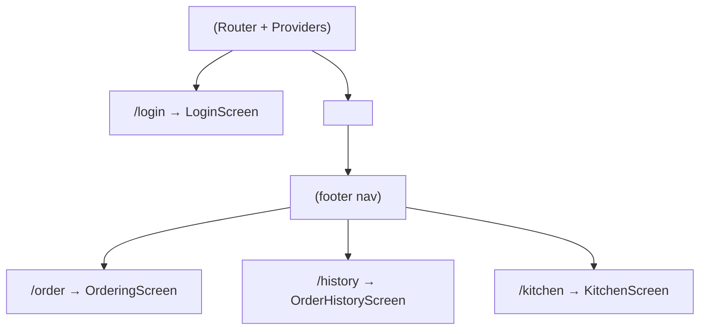
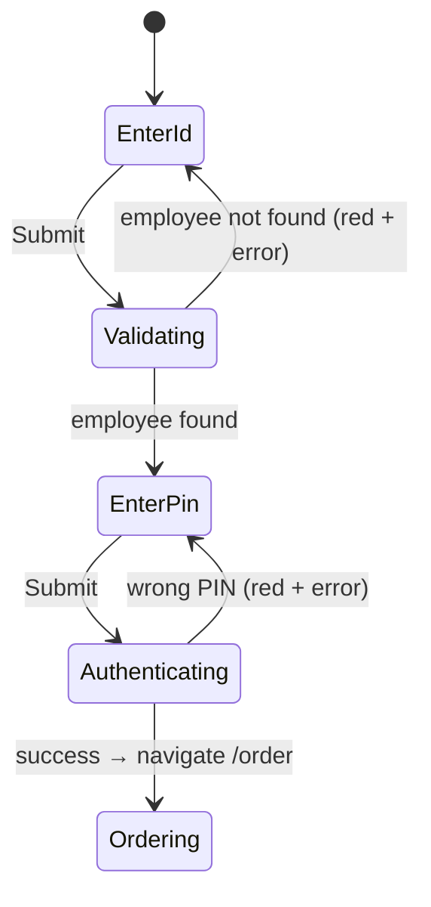
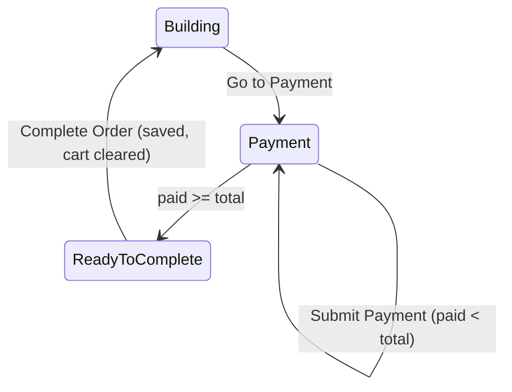
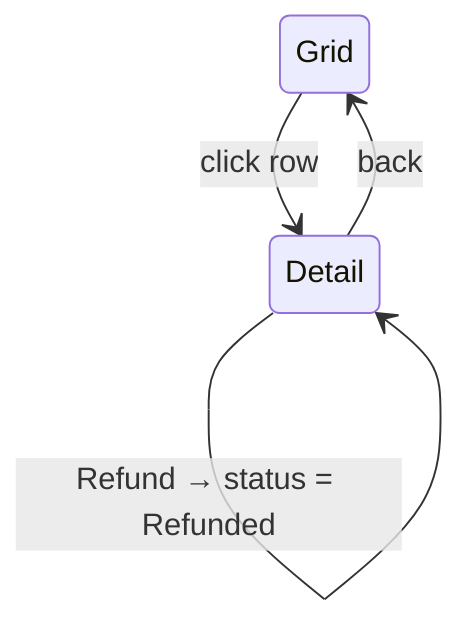
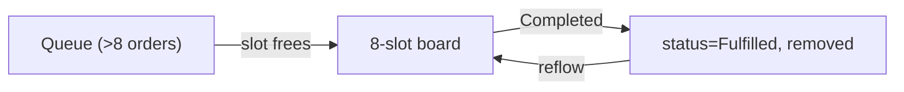

# Screen & UI Component Design

> Companion to [features.md](features.md). Describes the component tree, layout,
> and interaction design for each of the four screens. Built with **MUI v9**.

## Global Layout & Design Principles

- **Target displays:** landscape tablet, `1280×1024` → `1920×1080`. Layouts use
  flex/grid that scale fluidly; avoid fixed pixel widths where possible.
- **Touch-first:** large tap targets (min ~64px height for number-pad and menu
  buttons), generous spacing, no hover-only affordances.
- **Theme:** a single MUI theme (`src/theme.ts`) defines palette, typography
  scale, and a shared button size. Money is right-aligned and monospaced-ish for
  scanability.
- **App shell:** authenticated screens share an `<AppLayout>` with a persistent
  **footer navigation** (Ordering / Order History / Kitchen). Login has no footer.



## Shared Components

| Component | Responsibility |
| --- | --- |
| `AppLayout` | Wraps authenticated screens; renders `<Outlet/>` + `FooterNav`. |
| `FooterNav` | MUI `BottomNavigation`; links to Ordering / History / Kitchen. |
| `RequireAuth` | Route guard; redirects to `/login` when no session. |
| `NumberPad` | Reusable grid pad. Configurable key set + `onKey(value)`. Used by Login (with A–D) and Payment (0–9 only). |
| `Money` | Renders integer cents as `$0.00`. |
| `MenuButton` | Icon + text vertical button used in Panes 1 & 2. |
| `QuantityStepper` | +/- control for line-item quantity (Pane 3). |
| `LoadingState` / `ErrorState` | MUI skeleton / inline error banner for queries. |

---

## 1. Login Screen (`/login`)

Layout: centered column, no footer.

```
┌───────────────────────────────┐
│        [ Employee ID ____ ]   │  ← unmasked input, hint "Enter employee ID"
│        [   error text   ]     │  ← red border + message when not found
│                               │
│        ┌───┬───┬───┬───┐      │
│        │ A │ 1 │ 2 │ 3 │      │
│        │ B │ 4 │ 5 │ 6 │      │  ← NumberPad (0-9 + A-D)
│        │ C │ 7 │ 8 │ 9 │      │
│        │ D │   │ 0 │   │      │
│        └───┴───┴───┴───┘      │
│           [  Submit  ]        │
│                               │
│  Demo user: 1A2B3C / PIN 1234 │  ← test-credential hint (features.md)
└───────────────────────────────┘
```

Components: `LoginScreen` → `NumberPad`, `EmployeeIdField`, `PinField`,
`SubmitButton`, `DemoCredentialHint`.

Interaction / state machine:



Rules:
- Employee ID field: **unmasked**, 6 chars from `[0-9A-D]`.
- PIN field appears only after a valid id; **masked**, 4 digits `[0-9]`.
- Number pad drives whichever field is active.
- On success, set auth session (Zustand) and route to `/order`.

---

## 2. Ordering Screen (`/order`)

Four vertical panes + footer. Grid: 4 columns (Pane 4 slightly wider for the
summary), full height minus footer.

| Pane 1 | Pane 2 | Pane 3 | Pane 4 |
| --- | --- | --- | --- |
| `CategoryList` | `CategoryItemList` | `ItemConfigurator` / `PaymentPanel` | `OrderSummary` |

```
┌────────┬────────────┬───────────────────────┬──────────────────┐
│Category│ Cat. Items │  Item + Modifiers      │  Order Summary   │
│(Pane1) │  (Pane 2)  │       (Pane 3)         │     (Pane 4)     │
│ Combos │ Combo #1   │ ┌ Burger  [modifiers] │ Cheeseburger 5.20│
│ Tacos  │ Combo #2   │ ├ Side [Fries|Tots]   │  + Pickles  0.10 │
│ Drinks │ ...        │ └ Drink [size|kind]   │  - Cheese  -0.50 │
│ ...    │            │                        │ ...              │
│        │            │ [   Add to Order   ]  │ [ Go to Payment ]│
└────────┴────────────┴───────────────────────┴──────────────────┘
                    [ Ordering | History | Kitchen ]  ← FooterNav
```

### Pane 1 — `CategoryList`
Vertical stack of `MenuButton` (icon + text). Selecting sets `activeCategoryId`.

### Pane 2 — `CategoryItemList`
Vertical stack of `MenuButton` for the active category's items. Selecting sets
`activeCategoryItemId` and loads its configurable `MenuItem`(s) into Pane 3.

### Pane 3 — `ItemConfigurator`
Horizontal sections per sub-item (e.g. Burger / Side / Drink). Each section
renders:
- **Sizes** → single-select chips/toggles (`MenuChoice`).
- **Options** → single-select group (e.g. Fries / Tots / Onion Rings).
- **Modifiers** → multi-select toggles (e.g. Add Pickles, No Cheese) showing
  their `+/-` price delta.
- `QuantityStepper`.
Footer button **"Add to Order"** builds an `OrderLineItem` (with price formula
from [data models](02-data-models.md#line-item-price-formula)) and appends it to
the cart store → appears in Pane 4.

### Pane 4 — `OrderSummary`
Vertical list of line items: name + price, with modifier lines indented beneath
(`Add Pickles 0.10`, `No Cheese -0.50`). Running total at bottom. Footer button
**"Go to Payment"** switches Pane 3 into `PaymentPanel`.

### Pane 3 (payment mode) — `PaymentPanel`
- Payment-method buttons: Card / Cash / Gift Certificate.
- `NumberPad` (0–9 only, **no decimal**); entry interpreted as whole cents.
- **"Submit Payment"** → append `Payment` to cart, decrement remaining balance.
- Shows total, amount paid, remaining.
- When `paid >= total`, reveal **"Complete Order"** → `createOrder` mutation,
  status `Kitchen`, then clear cart + reset panes.

Payment interaction:



---

## 3. Order History Screen (`/history`)

Two vertical sections.

```
┌──────────────────────────────────────────────┐
│ Search: [ text ______ ]  [ from ] [ to ]      │  ← OrderSearchBar
├──────────────────────────────────────────────┤
│ Order# │ Date        │ Status   │ Items       │  ← OrderHistoryGrid (10 rows)
│ 1042   │ 07/08 14:20 │ Fulfilled│ Taco, Nacho…│
│ ...                                           │
│                         [ ‹ 1 2 3 › ]         │  ← pagination
└──────────────────────────────────────────────┘
        [ Ordering | History | Kitchen ]
```

### Top — `OrderSearchBar`
Text input + date-range selectors. Drives the `orders` query params
(newest → oldest).

### Bottom — `OrderHistoryGrid`
MUI `DataGrid` (or `Table`) with columns **Order #, Date, Status, Items**.
- Items column = comma-delimited item names, **truncated at 30 characters**
  (features.md table) with an ellipsis.
- **10 rows visible**, pagination for the rest.
- Sorted newest → oldest.

### Row detail — `OrderDetailPanel`
Clicking a row **replaces the grid** with a detail pane resembling Pane 4:
- Line items (name, price, modifiers), like `OrderSummary`.
- Payment types + amounts.
- **"Refund"** button → marks order `Refunded` (mutation) + back-to-grid control.



---

## 4. Kitchen Screen (`/kitchen`)

Single pane, **8 sections** in a grid (e.g. 4 columns × 2 rows). Orders fill the
next available slot left→right, top→bottom.

```
┌──────────┬──────────┬──────────┬──────────┐
│ #1042    │ #1043    │ #1044    │ (empty)  │
│ 2x Taco  │ Burrito  │ Nachos   │          │
│  no onion│ ...      │ ...      │          │
│ [scroll] │          │          │          │
│[Completed]│[Completed]│[Completed]│         │
├──────────┼──────────┼──────────┼──────────┤
│ (empty)  │ (empty)  │ (empty)  │ (empty)  │
└──────────┴──────────┴──────────┴──────────┘
        [ Ordering | History | Kitchen ]
```

### `KitchenBoard`
- Queries orders with status `Kitchen` (see [state & routing](05-state-and-routing.md)
  for polling). Displays up to 8 as `KitchenOrderCard`s.
- If >8 kitchen orders exist, extras are **queued** and only enter the board when
  a visible card is completed. Remaining cards shift left/up to fill the gap.

### `KitchenOrderCard`
- **Order number** large + bold at top.
- Order details **without prices**; sized for ~8 visible lines.
- Overflow lines **auto-scroll every 10 seconds** (`useInterval`) then loop.
- Footer **"Completed"** button → sets status `Fulfilled` (mutation) → card
  removed, board re-flows, next queued order (if any) appears.



---

## Component Inventory (summary)

| Screen | Key components |
| --- | --- |
| Login | `LoginScreen`, `NumberPad`, `EmployeeIdField`, `PinField`, `DemoCredentialHint` |
| Ordering | `OrderingScreen`, `CategoryList`, `CategoryItemList`, `ItemConfigurator`, `OrderSummary`, `PaymentPanel`, `NumberPad`, `QuantityStepper` |
| History | `OrderHistoryScreen`, `OrderSearchBar`, `OrderHistoryGrid`, `OrderDetailPanel` |
| Kitchen | `KitchenScreen`, `KitchenBoard`, `KitchenOrderCard` |
| Shared | `AppLayout`, `FooterNav`, `RequireAuth`, `Money`, `MenuButton`, `LoadingState`, `ErrorState` |
