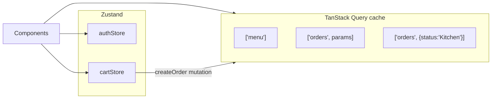
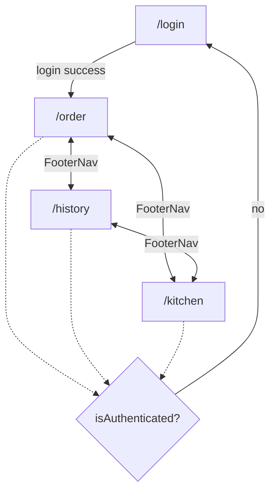

# State Management & Routing

> Companion to [features.md](features.md) and the
> [architecture overview](01-architecture.md). Defines how client state
> (**Zustand**), server state (**TanStack Query**), and navigation
> (**react-router v8**) are structured.

## 1. State Ownership

Two clear buckets — never duplicate one into the other.

| Kind | Owner | Examples |
| --- | --- | --- |
| **Server state** (fetched, cacheable, shared) | TanStack Query | Menu, order search results, order detail, kitchen orders. |
| **Client state** (local, session, UI) | Zustand | Auth session, active order/cart, payment entry, active pane selections. |



## 2. Zustand Stores

### `authStore` (`src/stores/authStore.ts`)
```ts
interface AuthState {
  sessionToken: string | null;
  employee: { id: string; name: string } | null;
  isAuthenticated: boolean;          // derived: sessionToken != null
  login(session: LoginResponse): void;
  logout(): void;
}
```
- Populated by the login mutation's `onSuccess`.
- In-memory only → a reload clears it (user is logged out; acceptable for demo).
- `RequireAuth` reads `isAuthenticated`.

### `cartStore` (`src/stores/cartStore.ts`)
Holds the in-progress order being built on the Ordering screen.
```ts
interface CartState {
  lineItems: OrderLineItem[];
  payments: Payment[];
  // derived selectors
  subtotalCents: number;
  totalCents: number;
  paidCents: number;
  remainingCents: number;            // max(total - paid, 0)
  isFullyPaid: boolean;              // paid >= total → enables "Complete Order"

  addLineItem(item: OrderLineItem): void;
  updateLineItemQuantity(lineId: string, qty: number): void;
  removeLineItem(lineId: string): void;
  addPayment(payment: Payment): void;
  removePayment(paymentId: string): void;
  clear(): void;                     // after Complete Order
}
```
- Price math uses the formula in [data models](02-data-models.md#line-item-price-formula).
- Derived values via Zustand selectors (recomputed from `lineItems`/`payments`).

### Ordering UI selection state
Pane 1/2/3 selections (`activeCategoryId`, `activeCategoryItemId`,
`paymentMode`) are ephemeral and local to the Ordering screen. Keep them in
component `useState`/`useReducer`, **not** a global store, unless they must
survive navigation (they don't for the demo).

## 3. TanStack Query Design

### Query keys
| Key | Endpoint | Notes |
| --- | --- | --- |
| `['menu']` | `GET /api/menu` | `staleTime: Infinity` (static seed). |
| `['orders', params]` | `GET /api/orders` | History search; `keepPreviousData` for pagination. |
| `['orders', id]` | `GET /api/orders/:id` | History detail panel. |
| `['orders', { status: 'Kitchen' }]` | `GET /api/orders?status=Kitchen` | Kitchen board. |

### Mutations
| Mutation | Endpoint | Invalidates |
| --- | --- | --- |
| `useLogin` | `POST /api/auth/login` | — (writes `authStore`). |
| `useCreateOrder` | `POST /api/orders` | `['orders']` (History + Kitchen refresh). |
| `useUpdateOrderStatus` | `PATCH /api/orders/:id/status` | `['orders']`, `['orders', id]`. |

- `QueryClientProvider` wraps the app in `main.tsx`.
- Default options: sensible `retry: 1`, `refetchOnWindowFocus: false` (kiosk).

### <a id="kitchen-polling"></a>Kitchen polling & 10s scroll
- **Board data:** `useQuery(['orders', {status:'Kitchen'}])` with
  `refetchInterval: 5000` so newly completed orders appear near-real-time.
  (Mutations also invalidate, so completing a card updates instantly.)
- **Card overflow scroll:** a per-card `useInterval(10000)` advances the visible
  8-line window through overflow lines, independent of data polling.
- **8-slot + queue logic** lives in the `KitchenBoard` component: it slices the
  fetched list to 8 visible; the remainder is a visual queue that only advances
  when a visible card is `Completed`.

## 4. Routing (react-router v8)

```ts
// src/router.tsx (conceptual)
const router = createBrowserRouter([
  { path: '/login', element: <LoginScreen /> },
  {
    element: <RequireAuth />,          // guard
    children: [
      {
        element: <AppLayout />,        // footer nav shell
        children: [
          { index: true, element: <Navigate to="/order" replace /> },
          { path: 'order',   element: <OrderingScreen /> },
          { path: 'history', element: <OrderHistoryScreen /> },
          { path: 'kitchen', element: <KitchenScreen /> },
        ],
      },
    ],
  },
  { path: '*', element: <Navigate to="/login" replace /> },
]);
```

| Route | Screen | Auth |
| --- | --- | --- |
| `/login` | Login | Public |
| `/order` | Ordering | Protected |
| `/history` | Order History | Protected |
| `/kitchen` | Kitchen | Protected |

### `RequireAuth`
```tsx
function RequireAuth() {
  const isAuthenticated = useAuthStore(s => s.isAuthenticated);
  return isAuthenticated ? <Outlet /> : <Navigate to="/login" replace />;
}
```
- All order/history/kitchen screens are gated (features.md security).
- On successful login the mutation writes `authStore`, then navigates to `/order`.

### Navigation flow



## 5. Data-flow Summary

- **Read:** component → `useQuery` → API client → MSW → seed store.
- **Build order:** component → `cartStore` (local, derived totals).
- **Commit order:** `useCreateOrder` → MSW writes store → invalidates
  `['orders']` → History + Kitchen reflect it.
- **Kitchen/refund transitions:** `useUpdateOrderStatus` → MSW updates store →
  invalidation refreshes affected queries.
