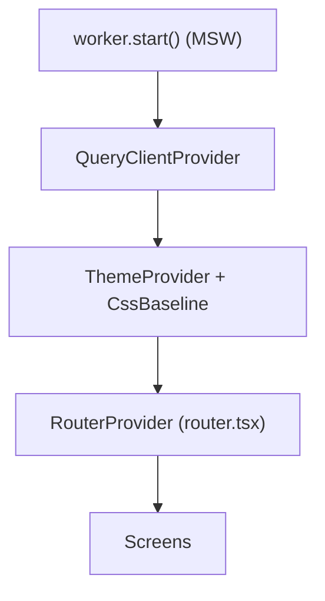

# Folder Structure & Conventions

> Companion to [features.md](features.md) and the
> [architecture overview](01-architecture.md). Defines the proposed source
> layout and coding conventions for the POS demo.

## 1. Proposed `src/` Layout

Feature-first: each screen owns its components; truly shared pieces live in
top-level folders.

```
src/
├── main.tsx                  # Entry: providers, MSW worker start, router
├── App.tsx                   # (thin) or replaced by router.tsx
├── router.tsx                # Route tree + RequireAuth wiring
├── theme.ts                  # MUI theme (palette, typography, sizing)
│
├── types/                    # Domain models (see 02-data-models.md)
│   ├── menu.ts
│   ├── order.ts
│   ├── employee.ts
│   └── index.ts
│
├── api/                      # Data-access layer (typed fetch wrappers)
│   ├── client.ts             # base fetch + Authorization header + error mapping
│   ├── auth.ts               # login, employeeExists
│   ├── menu.ts               # getMenu
│   └── orders.ts             # searchOrders, getOrder, createOrder, updateStatus
│
├── queries/                  # TanStack Query hooks + keys
│   ├── keys.ts               # queryKey factory
│   ├── useMenu.ts
│   ├── useOrders.ts
│   ├── useOrder.ts
│   ├── useKitchenOrders.ts
│   ├── useLogin.ts
│   ├── useCreateOrder.ts
│   └── useUpdateOrderStatus.ts
│
├── stores/                   # Zustand client state
│   ├── authStore.ts
│   └── cartStore.ts
│
├── mocks/                    # MSW mock backend
│   ├── browser.ts            # setupWorker
│   ├── handlers.ts           # request handlers (implements 04-api-contract.md)
│   ├── db.ts                 # in-memory store + mutation helpers
│   └── seed/
│       ├── menu.ts           # Mexican fast-food menu
│       ├── employees.ts      # mock employee(s) + demo credentials
│       └── orders.ts         # 15 seed orders
│
├── components/               # Shared, cross-screen components
│   ├── AppLayout.tsx
│   ├── FooterNav.tsx
│   ├── RequireAuth.tsx
│   ├── NumberPad.tsx
│   ├── Money.tsx
│   ├── MenuButton.tsx
│   ├── QuantityStepper.tsx
│   ├── LoadingState.tsx
│   └── ErrorState.tsx
│
├── features/                 # One folder per screen
│   ├── login/
│   │   ├── LoginScreen.tsx
│   │   ├── EmployeeIdField.tsx
│   │   ├── PinField.tsx
│   │   └── DemoCredentialHint.tsx
│   ├── ordering/
│   │   ├── OrderingScreen.tsx
│   │   ├── CategoryList.tsx        # Pane 1
│   │   ├── CategoryItemList.tsx    # Pane 2
│   │   ├── ItemConfigurator.tsx    # Pane 3 (build mode)
│   │   ├── PaymentPanel.tsx        # Pane 3 (payment mode)
│   │   └── OrderSummary.tsx        # Pane 4
│   ├── history/
│   │   ├── OrderHistoryScreen.tsx
│   │   ├── OrderSearchBar.tsx
│   │   ├── OrderHistoryGrid.tsx
│   │   └── OrderDetailPanel.tsx
│   └── kitchen/
│       ├── KitchenScreen.tsx
│       ├── KitchenBoard.tsx
│       └── KitchenOrderCard.tsx
│
├── lib/                      # Pure helpers
│   ├── money.ts              # formatMoney(cents), price math
│   ├── pricing.ts            # line-item price computation
│   ├── validators.ts         # employeeId / pin validation
│   └── useInterval.ts        # 10s scroll / polling helper
|
├──__tests__/
|   ├──...
│
└── assets/                   # Static assets (existing)
```

## 2. Naming Conventions

| Item | Convention | Example |
| --- | --- | --- |
| Components / files | `PascalCase.tsx` | `OrderSummary.tsx` |
| Hooks | `useX.ts`, camelCase | `useKitchenOrders.ts` |
| Stores | `xStore.ts` | `cartStore.ts` |
| Types/interfaces | `PascalCase` | `OrderLineItem` |
| Non-component modules | `camelCase.ts` | `money.ts` |
| Query keys | factory in `queries/keys.ts` | `keys.orders(params)` |
| Constants | `UPPER_SNAKE_CASE` | `PAGE_SIZE` |

## 3. Coding Conventions

- **TypeScript strict**; no `any`. Domain types imported from `src/types`.
- **Function components + hooks only.** No class components.
- **MUI is the exclusive UI library.** Build all UI from `@mui/material`
  (+ `@mui/x-data-grid` for the History grid, `@mui/icons-material` for icons).
  Do not add other component kits.
- **MUI styling** via `sx` prop and `styled()`; avoid ad-hoc CSS files beyond
  `index.css` globals. One central `theme.ts`.
- **Money** is always integer cents in state/logic; format only at render via
  `Money` / `formatMoney`. Never do float math on prices.
- **Server vs client state discipline** — follow
  [state & routing](05-state-and-routing.md#1-state-ownership). Never copy query
  data into Zustand.
- **API isolation** — components never call `fetch` directly; they use `queries/`
  hooks which call `api/` wrappers. This keeps the MSW seam clean.
- **Barrel exports** (`index.ts`) only for `types/`; avoid deep barrels that
  hurt tree-shaking.
- **Accessibility/touch** — interactive elements are real buttons with adequate
  size; labels present for inputs.

## 4. ESLint / Formatting

- Use the existing `eslint.config.js` (typescript-eslint + react-hooks).
- Recommend enabling type-aware rules (per README) once app code lands.
- Keep components small; extract sub-components when a file exceeds ~200 lines.

## 5. Startup Wiring (`main.tsx`)

Order of initialization:
1. Start MSW worker (`await worker.start()`), including in production (static
   demo has no backend).
2. Create `QueryClient`, wrap app in `QueryClientProvider`.
3. Wrap in MUI `ThemeProvider` + `CssBaseline`.
4. Render `RouterProvider` with the route tree from `router.tsx`.



## 6. Testing (recommended, optional for demo)

- Unit-test pure logic: `lib/pricing.ts`, `lib/money.ts`, `lib/validators.ts`.
- The MSW handlers double as a test backend for component/integration tests.
- Kitchen queue/reflow and payment "fully paid" gating are the highest-value
  behaviors to cover.
